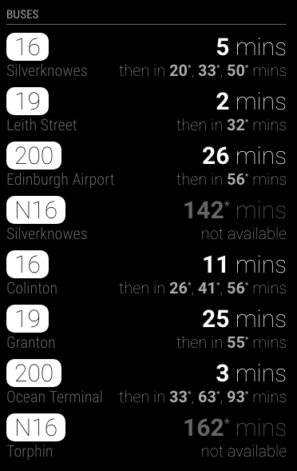

# MagicMirror Module: Lothian Buses

`MMM-LothianBuses` is a module for [MagicMirror](https://github.com/MichMich/MagicMirror) that allows you to display real time information about Lothian Buses bus stops.
The data is provided by [Transport for Edinburgh Open data](https://tfe-opendata.readme.io/) scheme.



## Usage

### Prerequisites

This module requires an API key to work. You can make [a request to get one here](http://www.mybustracker.co.uk/?page=API%20Key).

### Setup

Clone this module into your MagicMirror's `modules` directory

```shell script
cd modules
git clone https://github.com/tbouron/MMM-LothianBuses
```

then add the module to your MagicMirror's configuration. Here is an example:

```javascript
/* MagicMirror/config/config.js */
{
    /* ...your other config here */

    modules: [

        /* ...your other modules here */

        {
            module: 'MMM-LothianBuses',
            header: 'Buses',
            position: 'top_left',
            config: {
                apiKey: '<YOUR-API-KEY>',
                busStopIds: [
                    '<BUS-STOP-ID-#1>',
                    '<BUS-STOP-ID-#2>',
                    '<BUS-STOP-ID-#3>',
                    ....
                ]
            }
        }
    ]
}
```

### Finding bus stop IDs

Go to [Google maps](https://www.google.co.uk/maps) and click on the bus stop you are interested in. The information card will display the bus stop ID associated to it.